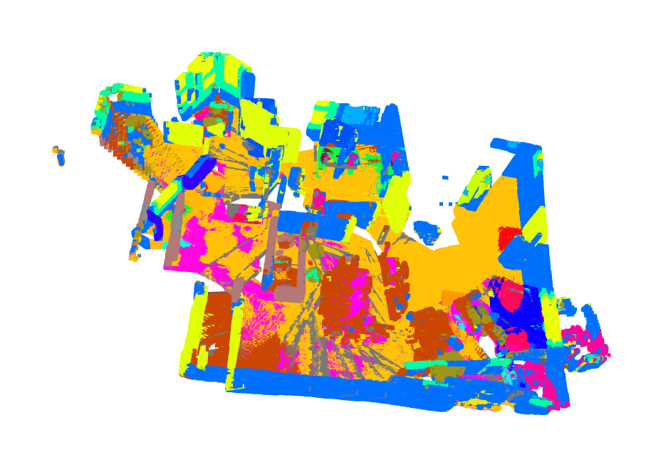
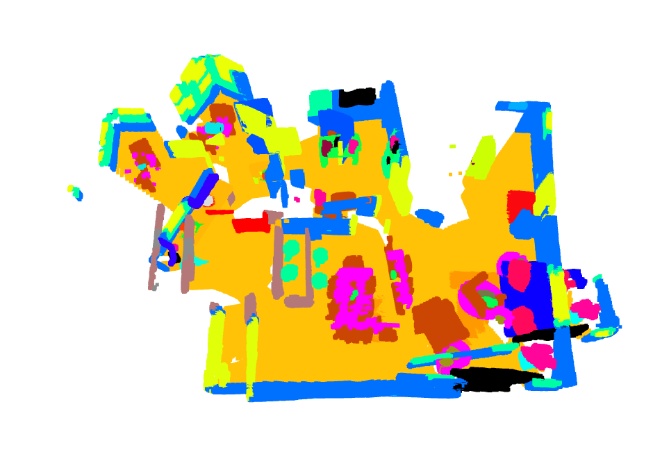

## Training segmentation model
- hrnetv2
- 1000 training images
- batch_size_per_gpu: 6
-  num_epoch: 50
-  epoch_iters: 100
-  Model trained on apartment_0's training result
   -  
- Model trained on apartment_0's val result 
   - 
-  Model trained on apartment_0's training result
   -  
- Model trained on apartment_0's val result 
   - 

## How to run the program
- You need to have this file structure as follows
```
data
|
└───rgb
|   |   1.png
|   |   2.png
|   |   3.png
|
└───model1
|   |   1.png
|   |   2.png
|   |   3.png
|
└───model2
|   |   1.png
|   |   2.png
|   |   3.png
|
└───truth
|   |   1.png
|   |   2.png
|   |   3.png

```

## Custom voxel down


## Result
- Semantic map (trained on other scenes)
- 
- Semantic map (trained on apartment_0)
- 
- Semantic map (ground truth)
- 