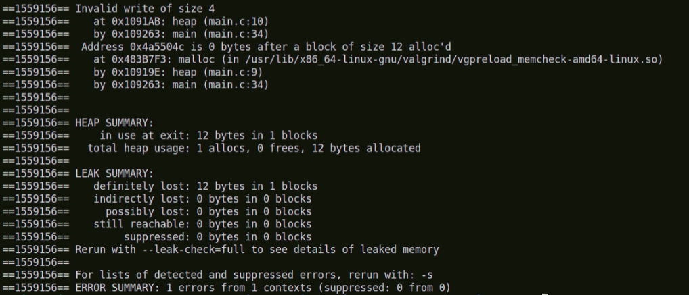
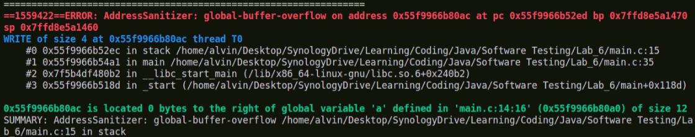
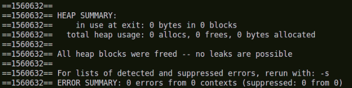
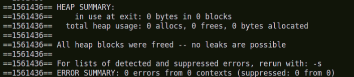
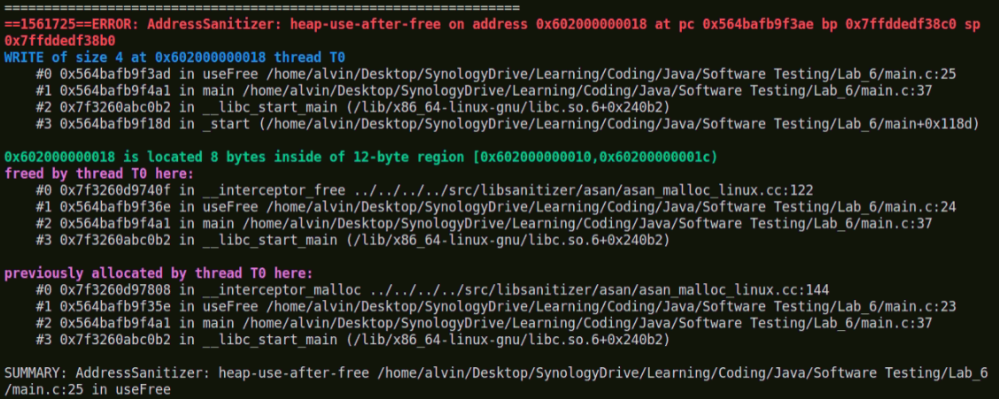
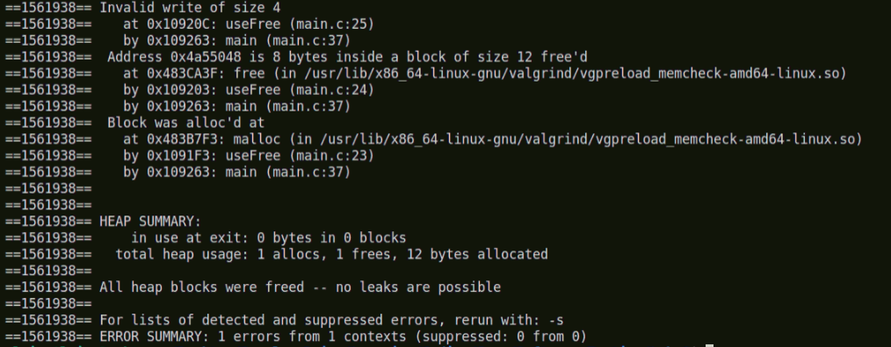
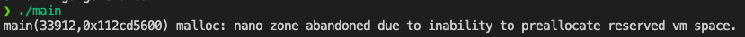

### Heap out-of-bounds read/write
Code
```c
void heap(){
    int* a = malloc(sizeof(int)*3);
    a[3] = 0;
}
```

### AScan Report

#### Valgrind Report

ASan✅
Valgrind✅
### Stack out-of-bounds read/write
Code
```c
void stack() {
    static int a[3]={0};
    a[3] = 0;
}
```
AScan Report

Valgrind Report

ASan✅
Valgrind❌
### Global out-of-bounds read/write
Code
```c
int global_a[3]={0};

void global(){
    global_a[3] = 0;
}
```
AScan Report

Valgrind Report

ASan✅
Valgrind❌
### Use-after-free
Code
```c
void useFree(){
    int* a = malloc(sizeof(int)*3);
    free(a);
    a[2] = 1;
}
```
AScan Report

Valgrind Report

ASan✅
Valgrind✅

### Use-after-return
Code
```c
//if Asan want to detect error need to use 
//fsanitize-address-use-after-return
char* x;

void useReturn() {
    char stack_buffer[42];
    x = &stack_buffer[13];
}

int main(){
    useReturn();
    *x = 42;
}
```
ASan❌
Valgrind❌

### redzone
```c
void redzone(){
    int a[8] = {0};
    int b[8] = {0};
    a[16] = 0;
}
```
ASan不會找到錯誤，但會有提示。
